# COMPSCI 591NR Project - Spring 2023 #

## Topic: 3D Scene/Object Reconstruction using CycleGANs with Binocular Stereopsis ##

### Generating Stereoscopic Renders via Depth Renderer on ShapeNet subset ###

| Object Class | Stereo Pair 1 Left Image | Stereo Pair 1 Right Image | Stereo Pair 2 Left Image | Stereo Pair 2 Right Image |
|--------------|--------------------------|---------------------------|--------------------------|---------------------------|
| **Bed 1** | 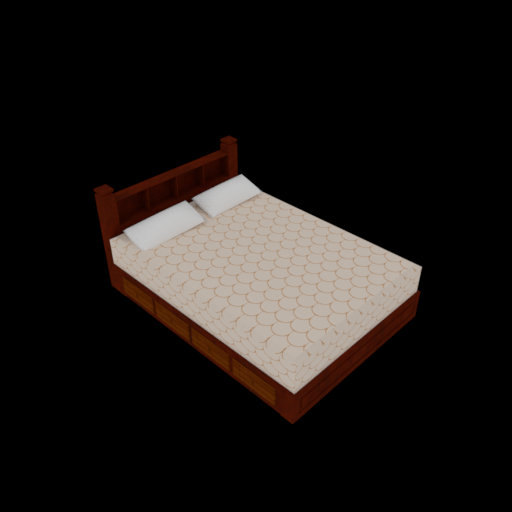 | 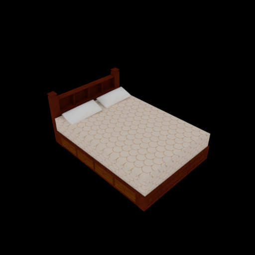 | 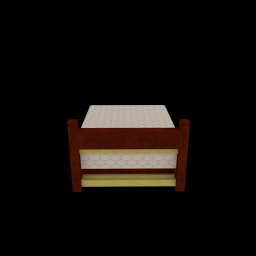 | 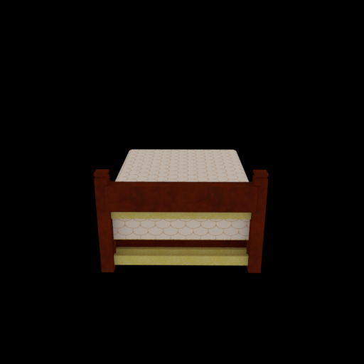 |
| **Bed 2** | 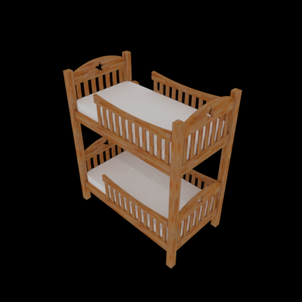 |  | 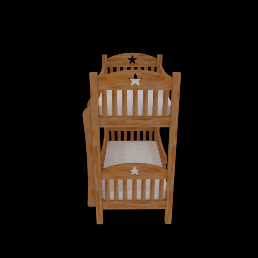 | 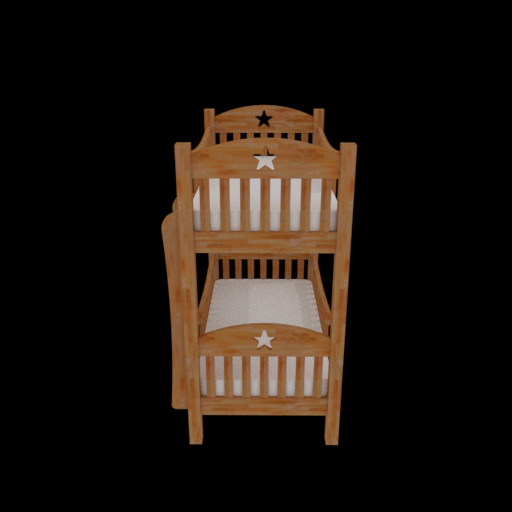 |
| **Chair 1** | 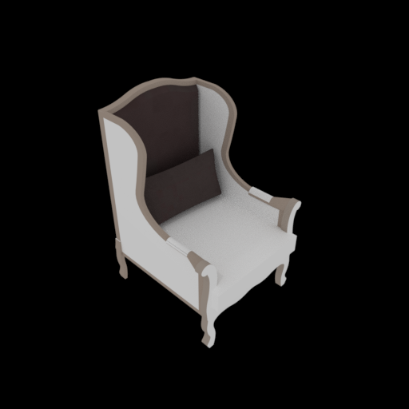 |  | 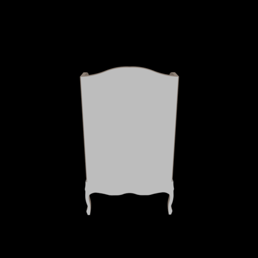 | 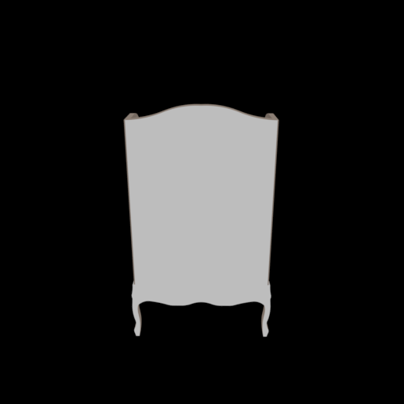 |
| **Chair 2** | 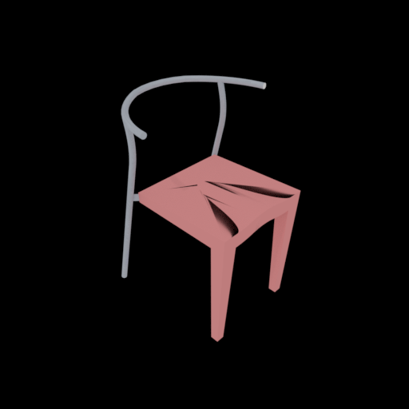 | 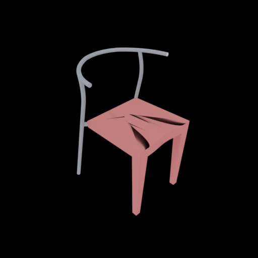 | 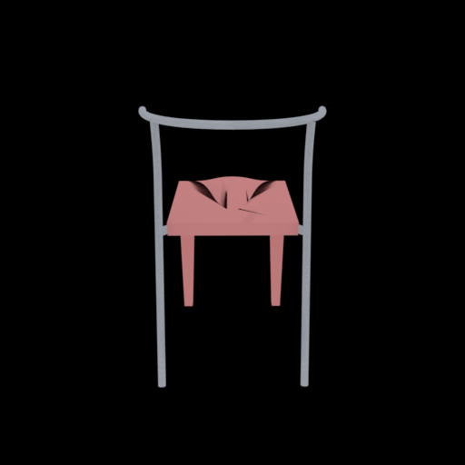 | 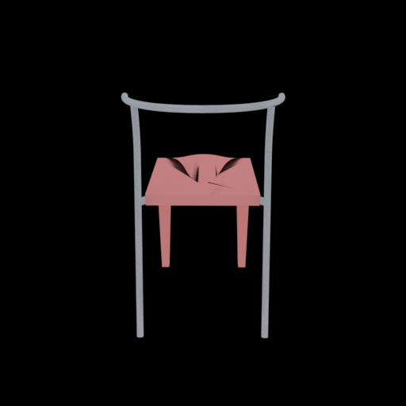 |

### Generating Depth/Disparity Map from Pair of Steroscopic Images ###

| Input Image (Left) | Input Image (Right) | Generated Depth Map |
|--------------------|---------------------|---------------------|
|  |  | 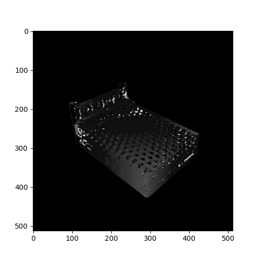 |
|  |  | 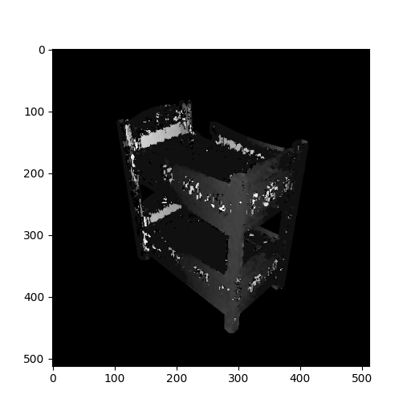 |
|  |  |  |
|  |  | 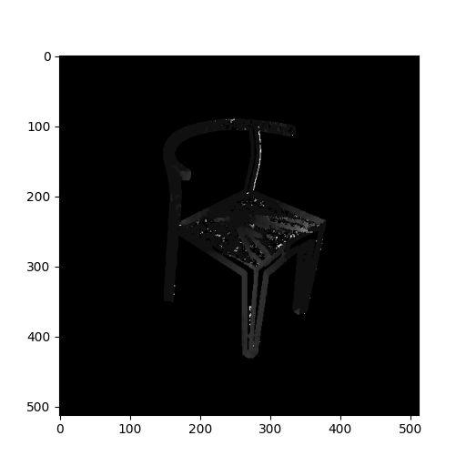 |

## References and Works Used ##

1. [Depth_Renderer](https://github.com/yinyunie/depth_renderer)

    ```bibtex
    @inproceedings{
        NEURIPS2020_ba036d22,
        author = {Nie, Yinyu and Lin, Yiqun and Han, Xiaoguang and Guo, Shihui and Chang, Jian and Cui, Shuguang and Zhang, Jian.J},
        booktitle = {Advances in Neural Information Processing Systems},
        editor = {H. Larochelle and M. Ranzato and R. Hadsell and M. F. Balcan and H. Lin},
        pages = {16119--16130},
        publisher = {Curran Associates, Inc.},
        title = {Skeleton-bridged Point Completion: From Global Inference to Local Adjustment},
        url = {https://proceedings.neurips.cc/paper/2020/file/ba036d228858d76fb89189853a5503bd-Paper.pdf},
        volume = {33},
        year = {2020}
    }
    ```

2. [GenRen](https://github.com/SamsungLabs/genren)

    ```bibtex
    @inproceedings{
        9320324,
        author={Aumentado-Armstrong, Tristan and Levinshtein, Alex and Tsogkas, Stavros and Derpanis, Konstantinos G. and Jepson, Allan D.},
        booktitle={2020 International Conference on 3D Vision (3DV)}, 
        title={Cycle-Consistent Generative Rendering for 2D-3D Modality Translation}, 
        year={2020},
        volume={},
        number={},
        pages={230-240},
        doi={10.1109/3DV50981.2020.00033}
        }
    ```
